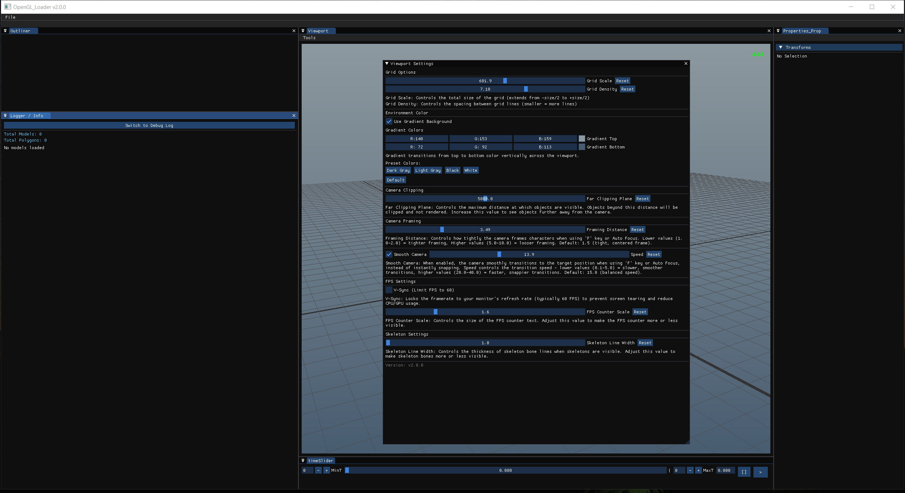
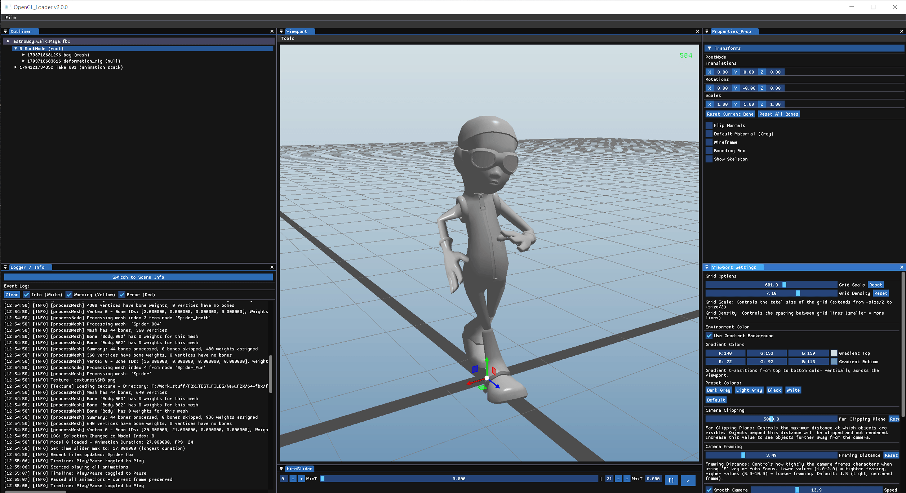
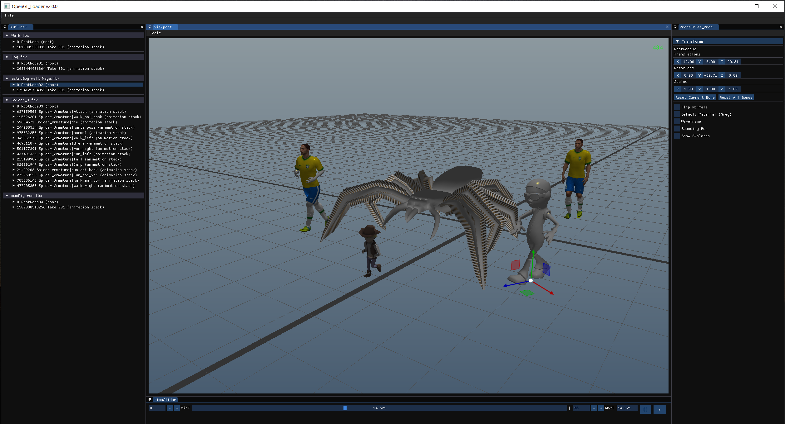
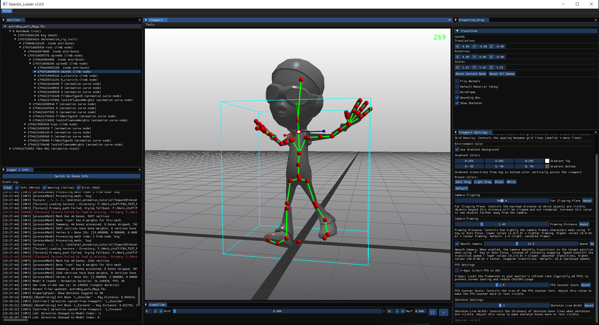
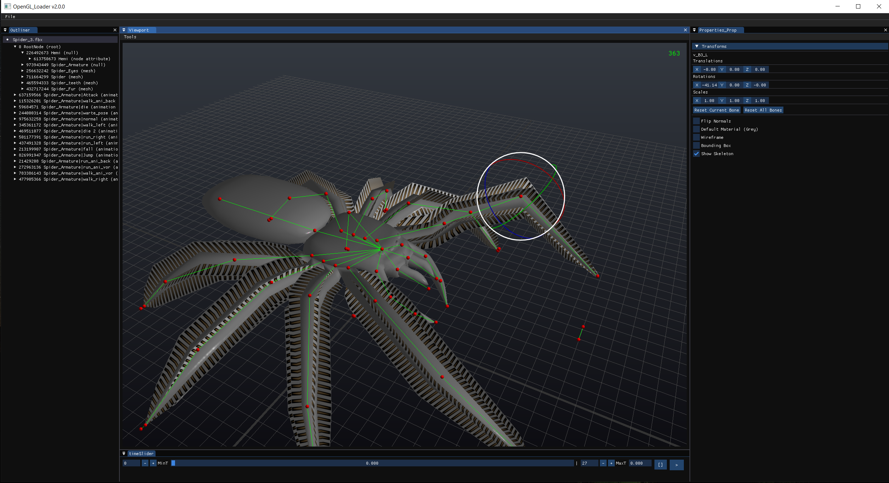
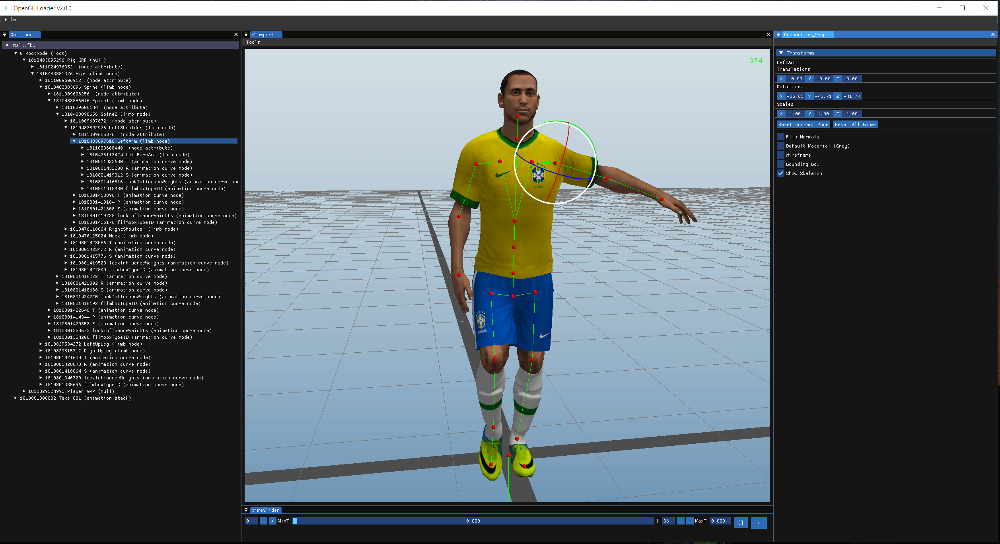
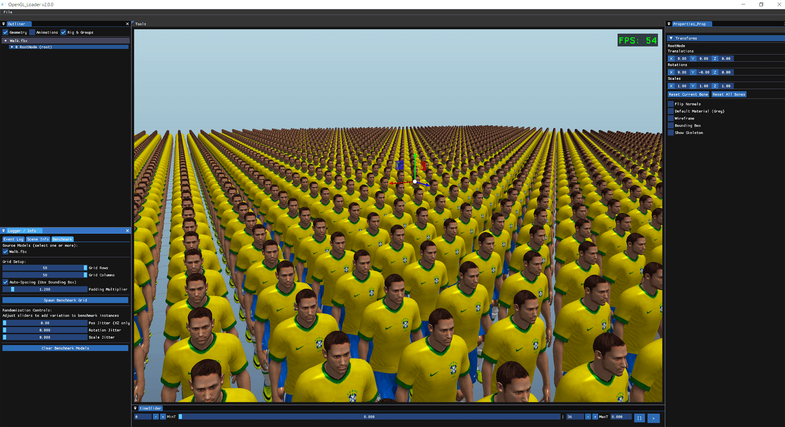
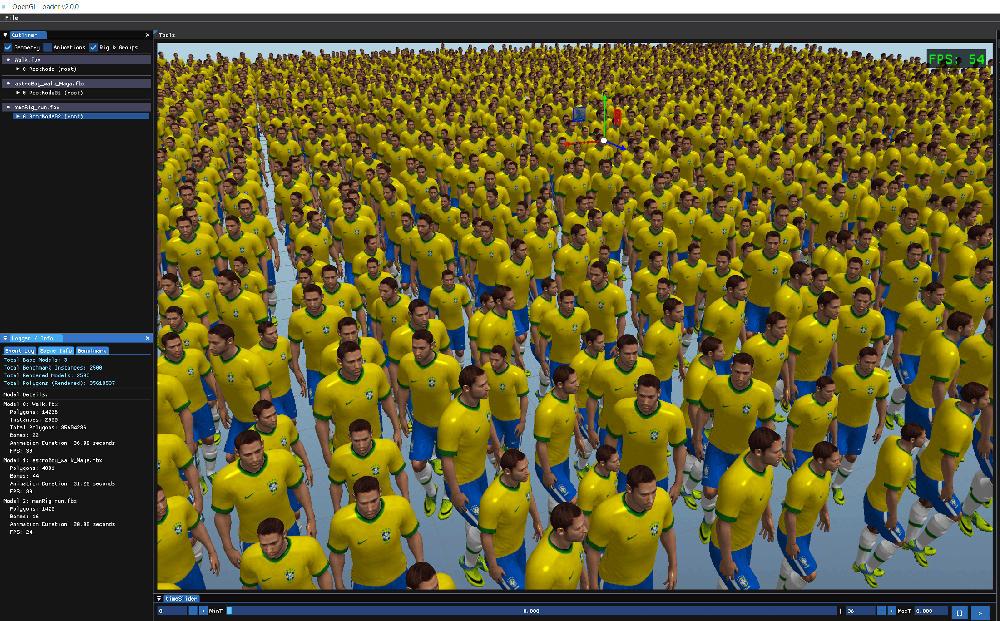
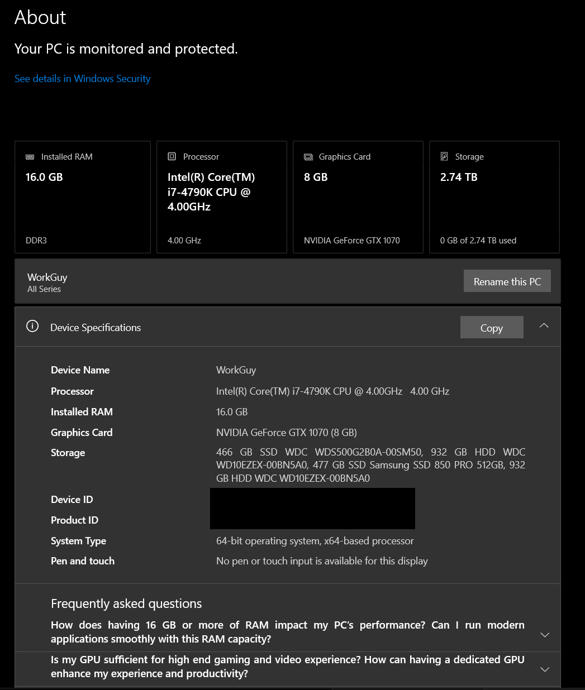
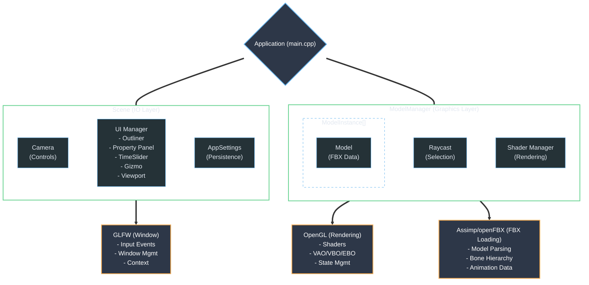

# OpenGL_Loader

OpenGL-based 3D model viewer and animation tool for loading, visualizing, and manipulating FBX files. This application provides a comprehensive interface for multi-model animation, bone manipulation, and real-time skeleton visualization .

## TL;DR

- **Multi-Model Support**: Load and animate multiple FBX files simultaneously with independent animation states.
- **Advanced Bone Manipulation**: Transform bones via PropertyPanel sliders or ImGuizmo 3D gizmo, featuring Maya-style shortcuts, arrow-key hierarchy navigation, and automatic World-to-Local coordinate space conversion.
- **Granular Bone Picking**: Click individual bones directly in the viewport using distance-aware thresholds.
- **Skeleton Visualization**: 3D sphere impostor joints with customizable line width and professional rendering.
- **Animation System**: Independent playback per model with play/pause/stop controls and frame scrubbing.
- **Auto-Focus Camera**: Automatically frames selected models/bones with smooth camera transitions.
- **Professional UI**: Dockable ImGui panels (Viewport, Outliner, PropertyPanel, TimeSlider, DebugPanel) with JSON-based settings persistence.
- **Performance Optimized**: Scalable architecture using **Hardware Instancing** for mass rendering, with efficient OpenGL resource management and optimized skeleton data structures.
- **Massive Crowd Rendering**: Benchmark system capable of rendering thousands of animated characters with high frame rates using hardware-accelerated instancing.

**Quick Demo:** For a quick evaluation without building from source, you can download the pre-compiled binary (.exe) and sample FBX models directly from the [Releases] tab.

**Quick Start:**
```bash
mkdir build && cd build
cmake ..
cmake --build . --config Release
./OpenGL_loader  # or OpenGL_loader.exe on Windows
```

## Video Showcase

<table>
<tr>
<td align="center" width="50%">
<a href="https://www.youtube.com/watch?v=PET7pFCNu40">
    
</a>
<br/>
<strong>OpenGL loader V1</strong>
</td>
<td align="center" width="50%">
<a href="https://www.youtube.com/watch?v=PPvJDx766N8">
    
</a>
<br/>
<strong>OpenGL loader V2</strong>
</td>
</tr>
</table>

## Image Gallery

### Core Features

<table>
<tr>
<td align="center">
  
  <br/>
  <strong>Main Application View</strong>
</td>
<td align="center">
  
  <br/>
  <strong>Dockable UI Panels</strong>
</td>
<td align="center">
  
  <br/>
  <strong>Multi-Model Support</strong>
</td>
</tr>
</table>

### Model Showcase

<table>
<tr>
<td align="center">
  
  <br/>
  <strong>AstroBoy Character</strong>
</td>
<td align="center">
  
  <br/>
  <strong>Spider Model</strong>
</td>
<td align="center">
  
  <br/>
  <strong>Walk Animation</strong>
</td>
</tr>
</table>

### Performance & Benchmark

<table>
<tr>
<td align="center">
  
  <br/>
  <strong>Massive Instance Grid</strong>
</td>
<td align="center">
  
  <br/>
  <strong>Mixed Model Instancing</strong>
</td>
<td align="center">
  
  <br/>
  <strong>Benchmark Environment</strong>
</td>
</tr>
</table>

------------------------------------------------------------------------

## Overview

OpenGL_Loader is a professional 3D model viewer and animation tool built with OpenGL, ImGui, and Assimp. It provides a comprehensive interface for loading, viewing, and multiple FBX files simultaneously, with advanced features for bone manipulation and skeleton visualization.

### Project Inspiration
This tool was inspired by a custom internal utility I developed for my team during my tenure as a CG Engineer at Intel. While the original tool served specific production needs, this personal project was rebuilt entirely from scratch to create a generalized, high-performance animation environment.

Note on Compatibility: As development was frozen during the team's transition, the tool is primarily optimized for FBX versions 2016-2020. While it handles core rigging and skinning data effectively, newer FBX features or non-standard axis orientations (outside of Y-Up) may result in visual discrepancies. For the most stable experience, it is recommended to use the sample models provided in the /Assets directory.


The system follows a clean architecture with clear separation of concerns:
- **Graphics Layer**: Rendering, model loading, shader management, mathematical utilities
- **IO Layer**: Input handling, camera controls, settings persistence, UI components
- **Application Logic**: Scene management, animation system, transform pipeline

This architecture ensures the UI remains responsive during heavy operations (model loading, animation playback) while providing smooth, interactive user experience.

------------------------------------------------------------------------

## Core Features

### Multi-Model Support

Load and display multiple FBX files simultaneously with independent animation states.

**Features:**
- Load multiple models via **File → Import** menu or drag-and-drop FBX files directly into the viewport
- Each model maintains independent animation state (play/pause/stop)
- Per-model root node transforms (isolated positioning)
- Visual bounding boxes with (cyan for selected, yellow for unselected)
- Per-model visibility controls (skeleton, bounding box toggles)
- **Dual-Layer Visibility Control**: Toggle Skeleton, Bounding Box, Wireframe, and Normals globally (Tools menu) or per-model (PropertyPanel).
- Granular Bone Manipulation Full transform control (translation, rotation, scale) for every individual bone in the hierarchy using 3D gizmos or numeric input


**How to Use:**
1. Launch `OpenGL_loader` - it automatically loads settings from `app_settings.json`
2. Use **File → Import** to browse for FBX files, or drag-and-drop files directly into the viewport
3. Multiple models can be loaded simultaneously
4. Each model operates independently with its own animation state

**Use Case**: Compare animations side-by-side, work with multiple characters in the same scene, or analyze different model variations.

### Animation System

Professional animation playback.

**Features:**
- **Play/Pause Button (`>`)**: Toggles play state without resetting animation time (preserves current frame)
- **Stop Button (`[]`)**: Stops animation AND resets to frame 0 (starts from beginning)
- **Time Slider**: Frame-by-frame scrubbing with visual timeline
- **Independent FPS**: Each model tracks its own animation FPS and duration
- **Per-Vertex Bone Blending**: Up to 4 bones per vertex for smooth deformation
- **Animation Time Tracking**: Precise frame control with millisecond accuracy

**How to Use:**
1. **Play/Pause**: Click `>` button to toggle playback (preserves current frame when paused)
2. **Stop**: Click `[]` button to stop and reset to frame 0
3. **Scrub**: Drag time slider to jump to specific frames
4. **Frame Display**: Current frame number shown in TimeSlider panel

**Use Case**: Preview animations, analyze motion, or manually adjust bone transforms at specific frames.

### Hardware Instancing & Benchmark

A dedicated system for stress-testing and visualizing large-scale crowd simulations with full skeletal animation.

**Features:**
- **Hardware-Accelerated Instancing**: Utilizes `glDrawElementsInstanced` to render thousands of independent agents in a single draw call, significantly reducing CPU overhead.
- **Heterogeneous Populations**: Support for spawning a multiple FBX models simultaneously.
- **Real-Time Procedural Variation**: UI-controlled sliders for per-instance variation of Position (XZ jitter), Rotation (Y-axis), and Scale.
- **Adaptive Spacing Logic**: Built-in spacing calculations to handle models of varying bounding box sizes within the same crowd.

**How to Use:**
1. Open the **Benchmark** tab in the Logger/Info panel.
2. Select one or more models from the source list via checkboxes.
3. Set the grid dimensions (Rows/Columns) and click **Spawn Benchmark Grid**.
4. Adjust the **Randomization Controls** to add organic variation to the crowd.

**Use Case**: Stress-test rendering performance, visualize crowd/city-scale scenes, or validate instancing pipelines with skeletal animation.

### Bone Manipulation

Transform bones using PropertyPanel sliders or ImGuizmo 3D gizmo.

**Features:**
- **PropertyPanel**: Precise numeric controls for translation, rotation, and scale
- **ImGuizmo Gizmo**: Visual 3D manipulation with Maya-style shortcuts (W/E/R for translate/rotate/scale)
- **Adjustable Gizmo Size**: Use +/- keys to dynamically scale the 3D gizmo.
- **World-to-Local Conversion**: Automatic coordinate space conversion for rig roots
- **Scale Compensation**: 1:1 gizmo movement regardless of object scale
- **Transform Persistence**: Bone transforms saved in PropertyPanel bone maps
- **Real-Time Updates**: Gizmo and PropertyPanel stay synchronized during manipulation
- **Hierarchy Navigation**: Quickly traverse the skeletal structure using Up/Down arrow keys, providing a seamless workflow for bone selection and manipulation.

**How to Use:**
1. **PropertyPanel**: Use sliders for precise numeric control (Translation, Rotation, Scale)
2. **Gizmo**: Use 3D gizmo for visual manipulation (W/E/R keys to switch modes)
3. **Reset**: Click "Reset" buttons in PropertyPanel to restore default transforms

**Use Case**: Adjust character poses, fix animation issues, or create custom poses for analysis.

### Granular Bone Picking

Click individual bones in the viewport to select them directly.

**Features:**
- **Distance-Aware Threshold**: Picking threshold scales with character size and camera distance
- **Dynamic Precision**: Works on characters of any scale (tiny to massive)
- **Ray-to-Segment Distance**: Mathematical calculation for accurate bone selection
- **Visual Feedback**: Selected bone highlighted in Outliner and PropertyPanel
- **Skeleton Requirement**: Bone picking only active when skeleton is visible
- **Unified Hierarchy Navigation**: Use Arrow Keys (Up/Down) to traverse the skeleton.
    The selection remains synchronized between the Viewport and the Outliner in real-time, regardless of which panel is focused

**How to Use:**
1. **Enable Skeleton**: Toggle skeleton visibility for the model (per-model checkbox or **Tools → Show Skeletons**)
2. **Viewport Click**: Click directly on skeleton bones in the viewport (green lines, red joints)
3. **Outliner Click**: Alternatively, click on bone names in the Outliner panel
4. **Unified Hierarchy Navigation**: Use Arrow Keys (Up/Down) to traverse bones. Selection stays synced between Viewport and Outliner.

**Use Case**: Quickly select bones for manipulation without navigating the Outliner hierarchy.

### Skeleton Visualization

Professional 3D skeleton rendering with sphere impostor joints.

**Features:**
- **Sphere Impostor Technique**: 3D shaded spheres using fragment shader calculations (no geometry required)
- **Customizable Line Width**: Adjustable skeleton bone thickness (1.0 to 10.0)
- **Proportional Joint Size**: Joint radius scales with line width for visual consistency
- **Professional Lighting**: Fake 3D lighting creates realistic sphere appearance
- **Optimized Skeleton Structure**: Linear skeleton data layout for efficient traversal and rendering

**How to Use:**
1. Enable skeleton visibility via **Tools → Show Skeletons** or per-model checkbox
2. Adjust line width via **Viewport Settings → Skeleton Line Width** (1.0 to 10.0)
3. Joint size automatically scales with line width for visual consistency

**Use Case**: Visualize character rigs, debug bone hierarchies, or analyze skeleton structure.

### Auto-Focus Camera

Automatically frames selected models/bones with smooth camera transitions.

**Features:**
- **One-Shot Trigger**: Framing triggered once when 'F' key is pressed or Auto-Focus detects selection change
- **Mouse Interrupt**: Manual camera control always takes priority over auto-framing
- **Aspect Ratio Awareness**: Adjusts framing distance based on viewport aspect ratio
- **Smooth Transitions**: Exponential interpolation for professional camera movement
- **Bounding Box Based**: Uses model/bone bounding boxes for accurate framing
- **Advanced Transition Control**: UI sliders for both "Framing Distance" (zoom offset) and "Transition Speed" (cinematic to snappy).

**How to Use:**
1. **Manual Framing**: Press 'F' key to auto-frame selected model/bone
2. **Camera Settings**: Use the **Framing Distance** and **Speed** sliders in **Viewport Settings → Camera Framing** to fine-tune how the camera orbits and focuses on your selection.
3. **Auto-Focus**: Enable **Tools → Auto Focus** to automatically frame when gizmo is released
4. **Camera Controls**: 
   - **Orbit**: Alt + Left Mouse Button (drag)
   - **Zoom**: Mouse Wheel or Alt + Right Mouse Button (drag)
   - **Pan**: Alt + Middle Mouse Button (drag)

**Use Case**: Quickly focus on specific models or bones without manual camera adjustment.

### Professional UI

Dockable ImGui panels with comprehensive controls.

**Features:**
- **Viewport Panel**: 3D rendering with camera controls (orbit, zoom, pan)
- **Outliner**: Hierarchical view of all loaded models' bone structures with keyboard navigation
- **PropertyPanel**: Transform controls for selected nodes with reset buttons
- **TimeSlider**: Animation timeline with play/pause/stop controls and frame display
- **Logger / Info Panel**: A comprehensive, multi-tabbed diagnostic and testing hub featuring:
  - **Event Log**: Structured logging system with color-coded filtering (Info/Warning/Error) and click-to-copy functionality.
  - **Scene Info**: Real-time statistics displaying global polygon counts, alongside per-model metrics (polygons, bone count, animation duration, FPS).
  - **Benchmark**: Dedicated control center for the Hardware Instancing system, featuring source model selection (single or multi-model mixing), grid dimension setup, auto-spacing calculations, and randomization controls (Position, Rotation, Scale jitter).
- **Viewport Settings**: Comprehensive control panel for the rendering environment and visual aids, with all parameters automatically persisted to `app_settings.json`:
  - **Grid Options**: Adjustable grid scale and line density parameters.
  - **Environment**: Toggle gradient backgrounds with custom RGB color pickers and quick color presets.
  - **Camera Controls**: Far clipping plane adjustment and smooth camera framing settings (Distance and Speed modifiers).
  - **FPS & Skeleton**: V-Sync toggle, FPS counter scaling, and global skeleton line width adjustment.

**Use Case**: Customize workspace layout, access all features quickly, or debug application behavior.

### Settings Persistence

JSON-based configuration with automatic saving.

**Features:**
- **Recent Files**: Tracks last 6 imported files with path canonicalization
- **Camera State**: Saves camera position, rotation, and zoom level
- **Window Layout**: Preserves ImGui docking layout between sessions
- **Environment Settings**: Gradient colors, skeleton line width, far clipping plane
- **UI State Persistence**: Essential application states, including camera configuration, window layout, Outliner filters (Geometry, Animations, Rigs), and Logger levels (Info, Warning, Error), are automatically persisted to `app_settings.json`
- **Auto-Save**: Throttled auto-save (60-second interval) prevents excessive disk writes
- **Migration Logic**: Handles missing keys and invalid values with sensible defaults

**Use Case**: Maintain workflow continuity, preserve camera positions, or share settings between machines.

------------------------------------------------------------------------

## Controls & Shortcuts

| Shortcut | Action |
|----------|--------|
| **W**   | Switch gizmo to Translate mode |
| **E**   | Switch gizmo to Rotate mode |
| **R**   | Switch gizmo to Scale mode |
| **+ / -** | Increase / Decrease gizmo visual size |
| **F**   | Frame selected model/bone (auto-focus) |
| **Alt + Left Mouse** | Orbit camera |
| **Alt + Right Mouse** | Zoom camera |
| **Alt + Middle Mouse** | Pan camera |
| **Arrow Keys (Up/Down)** | Navigate bone hierarchy through Outliner or Viewport |
| **Double-click Outliner** | Select bone/node |
| **Click Viewport** | Select model (or bone if skeleton visible) |

------------------------------------------------------------------------

## Architecture

The system follows a modular architecture with clear separation between graphics rendering, input handling, and application logic:

### Graphics Layer Components

#### 1. Model (`src/graphics/model.h/cpp`)
**Purpose**: Single FBX model loading and rendering with animation support

**Key Features:**
- Assimp-based FBX loading with bone hierarchy parsing
- Per-vertex bone blending (up to 4 bones per vertex)
- Linear skeleton optimization for performance
- Bone picking via ray-to-segment distance calculation
- Sphere impostor rendering for skeleton visualization
- **Graceful Texture Fallback**: Automatically applies a default gray material to geometry when texture files are missing or paths are invalid, ensuring uninterrupted rendering.

**Performance**: Linear skeleton structure provides efficient traversal for animation and rendering.

#### 2. ModelManager (`src/graphics/model_manager.h/cpp`)
**Purpose**: Multi-model management with independent animation states

**Key Features:**
- Collection of ModelInstance objects (wraps Model with animation state)
- Independent animation playback per model
- Per-model root node transform isolation
- Global skeleton/bounding box visibility toggles
- Efficient rendering pipeline with shared shader uniforms

**Design Decision**: ModelInstance separates animation state from model data, allowing multiple instances of the same model with different animations.

#### 3. Raycast (`src/graphics/raycast.h/cpp`)
**Purpose**: High-performance raycasting for viewport selection

**Key Features:**
- Screen-to-world ray conversion using inverse view/projection matrices
- Kay-Kajiya slab method for AABB intersection (O(1) complexity)
- Ray-to-line-segment distance calculation for bone picking
- Pre-calculated inverse direction for performance optimization

**Performance**: Pre-calculated inverse direction avoids divisions in hot path.

#### 4. BoundingBox (`src/graphics/bounding_box.h/cpp`)
**Purpose**: Visual bounding box rendering with selection-based styling

**Key Features:**
- Bone-based bounding box calculation (O(Bones) complexity)
- bounding box color coding (cyan for selected, yellow for unselected)
- Per-model visibility control

**Performance**: Bone-based calculation is ultra-fast compared to vertex iteration.

### IO Layer Components

#### 1. Scene (`src/io/scene.h/cpp`)
**Purpose**: Main scene management and application logic coordination

**Key Features:**
- Viewport framebuffer rendering with gradient background
- Camera framing logic with one-shot trigger and mouse interrupt
- Auto-focus feature integration
- UI panel coordination and layout management
- Settings integration and persistence

**Threading Model**: Single-threaded with action-based event handling.

#### 2. Camera (`src/io/camera.h/cpp`)
**Purpose**: Camera controls with smooth framing and aspect ratio awareness

**Key Features:**
- Orbit, zoom, and pan controls (Maya-style)
- Smooth camera framing with exponential interpolation
- Aspect ratio awareness for accurate framing
- Zoom clamping (1.0f to 90.0f) to prevent distortion
- Orbit distance safeguard (prevents division by zero)

**Design Decision**: Exponential interpolation provides smooth, professional camera movement.

#### 3. AppSettings (`src/io/app_settings.h/cpp`)
**Purpose**: Settings persistence with JSON serialization

**Key Features:**
- JSON-based configuration (app_settings.json)
- Recent files tracking with path canonicalization
- Auto-save throttling (60-second interval)
- Migration logic for invalid values
- Missing key handling with fallback to defaults

**File Location**: `app_settings.json` in executable directory or project root.

#### 4. UI Components (`src/io/ui/`)
**Purpose**: ImGui-based UI panels for user interaction

**Key Components:**
- **Outliner**: Hierarchical bone structure display with keyboard navigation
- **PropertyPanel**: Transform controls with bone maps and reset buttons
- **TimeSlider**: Animation timeline with transport controls
- **GizmoManager**: ImGuizmo integration with Maya-style shortcuts
- **ViewportPanel**: 3D viewport rendering with selection handling
- **DebugPanel**: Structured logging with filtering and copy-to-clipboard

**Design Decision**: Dockable windows provide flexible workspace layout.

### Data Flow

#### Model Loading

```
User selects FBX file (File menu or drag-and-drop)
    ↓
Scene::setFilePath()
    ↓
ModelManager::loadModel()
    ↓
Model::loadModel() (Assimp parsing)
    ↓
Model::processNode() (hierarchy traversal)
    ↓
Model::processMesh() (vertex/bone data extraction)
    ↓
Model::updateLinearSkeleton() (performance optimization)
    ↓
Outliner::addFBXScene() (UI hierarchy update)
    ↓
PropertyPanel::initializeBoneMaps() (transform storage)
```

#### Bone Picking

```
User clicks viewport
    ↓
ViewportPanel::handleMouseClick()
    ↓
ViewportSelectionManager::performSelection()
    ↓
Raycast::screenToWorldRay() (mouse to world ray)
    ↓
Raycast::rayIntersectsAABB() (model selection)
    ↓
Model::pickBone() (bone segment testing)
    ↓
Raycast::rayToLineSegmentDistance() (distance calculation)
    ↓
Outliner::setSelectionToNode() (UI update)
    ↓
PropertyPanel::updateFromSelection() (transform display)
```

#### Animation Playback

```
User clicks Play button
    ↓
TimeSlider::getPlay_stop() returns true
    ↓
Application::updateAnimations()
    ↓
ModelInstance::setPlaying(true)
    ↓
ModelInstance::updateAnimation() (time accumulation)
    ↓
Model::updateLinearSkeleton() (bone transform calculation)
    ↓
Model::render() (bone matrix upload to shader)
    ↓
GPU per-vertex bone blending (shader)
```

### Architecture Diagram




------------------------------------------------------------------------

<details>
<summary><h2>Project Structure</h2></summary>

```markdown
📁 OpenGL_loader/
│
├── 📁 src/                    # C++ source code
│   ├── 📁 graphics/           # Graphics rendering and model management
│   │   ├── 📄 model.h/cpp     # Single model loading and rendering
│   │   ├── 📄 model_manager.h/cpp  # Multi-model management
│   │   ├── 📄 mesh.h/cpp      # Mesh data and processing
│   │   ├── 📄 texture.h/cpp   # Texture loading and management
│   │   ├── 📄 material.h/cpp  # Material properties
│   │   ├── 📄 light.h/cpp     # Lighting system
│   │   ├── 📄 math3D.h/cpp    # Mathematical utilities
│   │   ├── 📄 shader.h/cpp    # Shader management
│   │   ├── 📄 grid.h/cpp      # Grid rendering
│   │   ├── 📄 bounding_box.h/cpp  # Bounding box rendering
│   │   ├── 📄 raycast.h/cpp   # Raycasting for viewport selection
│   │   ├── 📄 utils.h         # Graphics utilities
│   │   └── 📄 defines.h       # Math constants
│   ├── 📁 io/                 # Input/Output and UI
│   │   ├── 📄 scene.h/cpp    # Main scene management
│   │   ├── 📄 camera.h/cpp   # Camera controls
│   │   ├── 📄 joystick.h/cpp # Low-level joystick input
│   │   ├── 📄 keyboard.h/cpp # Low-level keyboard input
│   │   ├── 📄 mouse.h/cpp    # Low-level mouse input
│   │   ├── 📄 app_settings.h/cpp  # Settings persistence
│   │   ├── 📄 fbx_rig_analyzer.h/cpp  # FBX rig analysis
│   │   └── 📁 ui/             # ImGui UI panels
│   │       ├── 📄 outliner.h/cpp  # Hierarchy display
│   │       ├── 📄 property_panel.h/cpp  # Transform controls
│   │       ├── 📄 timeSlider.h/cpp  # Animation timeline
│   │       ├── 📄 gizmo_manager.h/cpp  # Gizmo manipulation
│   │       ├── 📄 imgui_miniSliderV3.h # Custom ImGui slider widget
│   │       ├── 📄 viewport_panel.h/cpp  # Viewport rendering
│   │       ├── 📄 viewport_settings_panel.h/cpp  # Viewport settings
│   │       ├── 📄 debug_panel.h/cpp  # Debug information
│   │       ├── 📄 ui_manager.h/cpp  # UI coordination
│   │       └── 📄 pch.h/cpp  # Precompiled header
│   ├── 📁 utils/              # Utility functions
│   │   └── 📄 logger.h/cpp   # Logging system
│   ├── 📄 application.h/cpp  # Main application class
│   ├── 📄 main.cpp            # Application entry point
│   ├── 📄 glad.c              # OpenGL loader initialization
│   ├── 📄 viewport_selection.h/cpp  # Viewport selection manager
│   └── 📄 version.h           # Version constants
│
├── 📁 Assets/                 # Shader files
│   ├── 📄 vertex.glsl         # Main vertex shader
│   ├── 📄 fragment.glsl       # Main fragment shader
│   ├── 📄 skeleton.vert.glsl  # Skeleton vertex shader
│   ├── 📄 skeleton.frag.glsl  # Skeleton fragment shader
│   ├── 📄 grid.vert.glsl      # Grid vertex shader
│   ├── 📄 grid.frag.glsl      # Grid fragment shader
│   ├── 📄 bounding_box.vert.glsl  # Bounding box vertex shader
│   ├── 📄 bounding_box.frag.glsl  # Bounding box fragment shader
│   ├── 📄 background.vert.glsl  # Background vertex shader
│   └── 📄 background.frag.glsl  # Background fragment shader
│
├── 📁 Dependencies/            # Third-party libraries
│   ├── 📁 imgui/               # ImGui UI framework
│   ├── 📁 ImGuizmo/            # 3D gizmo manipulation
│   ├── 📁 openFBX/             # FBX file parsing
│   ├── 📁 include/             # Header-only libraries (GLM, etc.)
│   └── 📁 lib/                 # Compiled libraries (Assimp, etc.)
│
├── 📁 MD/                      # Documentation files
│   └── 📄 *.md                 # Feature documentation (139 files)
│
├── 📁 media/                   # Screenshots and media
│
├── 📄 CMakeLists.txt           # CMake build configuration
├── 📄 app_settings.json        # Application settings (generated)
├── 📄 imgui.ini                 # ImGui layout (generated)
└── 📄 README.md                # This file
```

</details>

------------------------------------------------------------------------

## Installation

### Prerequisites

- **C++ Compiler**: 
  - Windows: MSVC 2017+ or MinGW
  - Linux: GCC 5.4+ or Clang 3.8+
  - macOS: Clang (Xcode)
- **CMake**: 3.14 or higher
- **OpenGL**: 3.3+ compatible graphics driver
- **Git**: For cloning dependencies (GLFW via FetchContent)

### Setup Steps

1. **Clone or download the project:**
   ```bash
   git clone <repository-url>
   cd OpenGL_loader
   ```

2. **Create build directory:**
   ```bash
   mkdir build && cd build
   ```

3. **Configure with CMake:**
   ```bash
   cmake ..
   ```
   
   **Windows (Visual Studio):**
   ```bash
   cmake .. -G "Visual Studio 17 2022" -A x64
   ```

4. **Build the project:**
   ```bash
   cmake --build . --config Release
   ```
   
   **Windows (Visual Studio):**
   ```bash
   cmake --build . --config Release
   ```
   
   **Linux/macOS:**
   ```bash
   make -j4
   ```

5. **Run the application:**
   ```bash
   ./OpenGL_loader  # or OpenGL_loader.exe on Windows
   ```

   **Note:** On first run, the application will create `app_settings.json` with default settings. You can also copy `app_settings.json.template` to `app_settings.json` and customize it before running.

### Verify Installation

- Application should start and display the viewport
- Check that ImGui panels are dockable and functional
- Verify File menu can load FBX files
- Test drag-and-drop FBX file loading
- Confirm `app_settings.json` is created in the executable directory

### Dependencies

The project uses CMake's `FetchContent` to automatically download GLFW. Other dependencies are included in the `Dependencies/` folder:

- **GLFW 3.3.8**: Window management (auto-downloaded)
- **ImGui**: UI framework (included)
- **ImGuizmo**: 3D gizmo manipulation (included)
- **GLM**: Mathematics library (header-only, included)
- **Assimp**: Model loading (precompiled, included)
- **openFBX**: FBX file parsing (included)
- **GLAD**: OpenGL loader (included)

------------------------------------------------------------------------

## Advanced Features

#### Bone Picking

- **Enable**: Toggle skeleton visibility for the model (per-model checkbox or global toggle)
- **Click**: Click directly on skeleton bones in the viewport
- **Precision**: Distance-aware threshold scales with character size and camera distance
- **Feedback**: Selected bone highlighted in Outliner and PropertyPanel

#### Auto-Focus

- **Enable**: Check **Tools → Auto Focus** in viewport menu
- **Behavior**: Camera automatically frames selected model/bone when gizmo is released
- **Manual Override**: Right mouse button interrupts auto-focus (manual control takes priority)
- **Configurable**: Adjust framing distance multiplier in Viewport Settings

#### Gradient Background

- **Enable**: Check **Viewport Settings → Use Gradient Background**
- **Customize**: Adjust top and bottom colors via color pickers
- **Presets**: Use preset buttons (Dark Gray, Light Gray, Black, White, Default)
- **Persistence**: Settings saved automatically to `app_settings.json`

#### Settings Management

- **Recent Files**: Last 6 imported files tracked in File menu
- **Auto-Save**: Settings automatically saved every 60 seconds (throttled)
- **Manual Save**: Settings saved on application shutdown
- **Location**: `app_settings.json` in executable directory or project root

#### Debug Panel

- **Open**: Click log icon or access via View menu
- **Filter**: Toggle Info/Warning/Error messages via checkboxes
- **Copy**: Click any log line to copy to clipboard
- **Clear**: Click "Clear" button to clear log history

------------------------------------------------------------------------

<details>
<summary><h2>Configuration</h2></summary>

The tool is configured via `app_settings.json`:

```json
{
    "recentFiles": [
        "F:/Work_stuff/Assets/models/Walk.fbx",
        "F:/Work_stuff/Assets/models/Run.fbx"
    ],
    "camera": {
        "position": [0.0, 5.0, 20.0],
        "yaw": -90.0,
        "pitch": -20.0,
        "zoom": 45.0
    },
    "environment": {
        "useGradient": true,
        "viewportGradientTop": [0.2, 0.3, 0.4],
        "viewportGradientBottom": [0.1, 0.15, 0.2],
        "skeletonLineWidth": 2.0,
        "farClipPlane": 5000.0,
        "framingDistanceMultiplier": 1.5,
        "autoFocusEnabled": false,
        "boundingBoxesEnabled": true,
        "skeletonsEnabled": false
    },
    "grid": {
        "centerLineColor": [0.2, 0.2, 0.2],
        "gridLineColor": [0.1, 0.1, 0.1]
    }
}
```

### Configuration Parameters

| Category | Parameter | Description |
|-----------|-------------|---------|
| **Root** | `recentFiles` | Array of recently imported file paths |
| **Camera** | `camera.position` | Camera world position (x, y, z) |
| | `camera.focusPoint` | Camera target focus point (x, y, z) |
| | `camera.yaw` / `pitch` | Camera horizontal and vertical rotation (degrees) |
| | `camera.zoom` / `orbitDistance` | Camera field of view and distance from focus point |
| | `camera.smoothCameraEnabled` | Toggles smooth exponential interpolation for camera movement |
| | `camera.smoothTransitionSpeed` | Speed multiplier for smooth camera transitions |
| | `camera.speed` / `sensitivity` | Base multipliers for manual camera movement and mouse sensitivity |
| **Environment** | `environment.useGradient` | Toggles gradient vs. solid color background |
| | `environment.backgroundColor` | Solid background color (RGBA) |
| | `environment.currentPresetName` | Currently active background color preset |
| | `environment.viewportGradientTop` / `Bottom` | Active gradient colors (RGB) |
| | `environment.skeletonLineWidth` | Global thickness of skeleton bone rendering |
| | `environment.farClipPlane` | Maximum clipping distance for the viewport |
| | `environment.framingDistanceMultiplier` | Distance multiplier when auto-framing models/bones |
| | `environment.autoFocusEnabled` | Toggles auto-framing on gizmo release |
| | `environment.boundingBoxesEnabled` | Global visibility toggle for bounding boxes |
| | `environment.skeletonsEnabled` | Global visibility toggle for skeletons |
| | `environment.vSyncEnabled` | Locks framerate to monitor refresh rate |
| | `environment.showFPS` / `fpsScale` | Toggles FPS counter visibility and controls text scale |
| | `environment.lastImportDirectory` | Tracks the last directory used in the file dialog |
| **Grid** | `grid.enabled` | Global visibility toggle for the floor grid |
| | `grid.size` / `spacing` | Controls the overall dimensions and line density of the grid |
| | `grid.centerLineColor` | RGB color for the center axes lines |
| | `grid.majorLineColor` / `minorLineColor` | RGB colors for the primary and secondary grid lines |
| **UI Layout** | `outliner.showGeometry` / `showAnimations` / `showRigGroups` | Toggles visibility filters in the Outliner panel |
| | `logger.showInfo` / `showWarning` / `showError` | Saves the active filter states in the Logger panel |
| | `window.width` / `height` / `posX` / `posY` | Restores the main application window size and position |

### Settings File Discovery

The application automatically searches for `app_settings.json` in multiple locations:
1. Same directory as executable (for deployment)
2. Project root directory (for development)
3. Current working directory

This allows the same executable to work in different deployment scenarios without modification.

### Recent Files

Recent files are automatically tracked with:
- **Path Canonicalization**: Absolute paths with forward slashes (`/`) for cross-platform compatibility
- **Duplicate Prevention**: Opening the same file multiple times results in only one entry (moved to top)
- **Existence Check**: Non-existent files are automatically removed from the list
- **Capacity Limit**: Maximum of 6 recent files (oldest removed when limit exceeded)

</details>

------------------------------------------------------------------------

<details>
<summary><h2>Performance</h2></summary>

### Optimizations

- **Hardware-Accelerated Instancing**: Massive crowd rendering optimization.
  - **Single-Pass Rendering**: Efficiently renders thousands of animated characters with a single draw call.
  - **GPU Memory Management**: Uses shared VBOs/EBOs to minimize overhead and maximize throughput.

- **Linear Skeleton Structure**: Optimized flat skeleton layout for efficient traversal
  - Pre-computed flat array of bone transforms
  - O(Bones) complexity instead of O(Bones × Depth)
  - Eliminates recursive parent chain traversal during rendering

- **RAII Resource Management**: Move semantics for GPU resources
  - Automatic cleanup of VAO/VBO/EBO on object destruction
  - Prevents resource leaks and double-deletion
  - Efficient resource transfer without expensive copies

- **Shared Shader Uniforms**: Moved outside model loop
  - View, projection, and lighting uniforms set once per frame
  - Reduces redundant OpenGL state changes
  - Improves rendering performance for multiple models

- **Bone-Based Bounding Box**: O(Bones) calculation instead of O(Vertices)
  - Ultra-fast bounding box updates
  - Enables real-time bounding box calculation for camera framing
  - Works regardless of mesh complexity

- **Pre-Calculated Inverse Direction**: Raycasting optimization
  - Inverse direction computed once during Ray construction
  - Avoids repeated divisions in AABB intersection tests
  - Critical for performance in bone picking hot path
  
  
### Benchmark Environment
All performance metrics and videos were recorded on a **12-year-old workstation** to demonstrate the engine's efficiency and optimization:

| Hardware Component | Specification |
|-------------------|---------------|
| **CPU** | Intel Core i7-4790K @ 4.00GHz |
| **GPU** | NVIDIA GeForce GTX 1070 (8GB) |
| **RAM** | 16.0 GB DDR3 |


### Performance Metrics

- **Massive Crowd Rendering**: Stable 60+ FPS with 1,000+ instanced animated characters (GPU dependent).
- **Skeleton Rendering**: < 1ms for typical character (100 bones)
- **Bone Picking**: < 5ms for ray-to-segment distance calculation
- **Model Loading**: Varies by FBX complexity (typically 100-500ms)
- **Animation Playback**: Smooth frame rates with multiple models
- **Memory Usage**: Minimal (~50MB base + ~10MB per model)

</details>

------------------------------------------------------------------------

## Dependencies

### Core Libraries

- **GLM 0.9.9.8**: Mathematics library (header-only)
- **GLFW 3.3.8**: Window management and input handling

### Model Loading

- **Assimp 5.0.0**: FBX/OBJ model loading and parsing
- **openFBX**: FBX file parsing (Lightweight standalone parser)

### UI Framework

- **ImGui 1.84.2**: Immediate mode GUI framework
- **ImGuizmo 1.83**: 3D gizmo manipulation widget

### Build System

- **CMake 3.14+**: Build configuration and dependency management
- **FetchContent**: Automatic GLFW download and integration

### System Requirements

- **Operating System**: Windows 7+, Linux, macOS
- **RAM**: 4GB minimum, 8GB recommended
- **Graphics**: OpenGL 3.3+ compatible GPU
- **Disk Space**: ~100MB for application and dependencies

------------------------------------------------------------------------

<details>
<summary><h2>Troubleshooting</h2></summary>

### Application Won't Start

**Issue: "Failed to initialize GLFW"**
- Verify graphics drivers are up to date
- Check that OpenGL 3.3+ is supported
- Ensure no other application is using exclusive fullscreen mode

**Issue: "Shader compilation failed"**
- Verify `Assets/` folder contains all shader files
- Check that shader files are not corrupted
- Ensure shader file paths are correct relative to executable

**Issue: "DLL not found" (Windows)**
- Verify `assimp-vc142-mt.dll` is in the same directory as executable
- Check that all required DLLs are present (Assimp, OpenGL drivers)

### Models Not Loading

**Issue: "FBX file fails to load"**
- Verify FBX file is not corrupted
- Check that file path contains no special characters
- Ensure Assimp DLL is accessible (Windows)
- Check Debug Panel for detailed error messages

**Issue: "Model loads but appears invisible"**
- Verify skeleton is visible (check per-model skeleton checkbox)
- Check that camera is positioned correctly (press 'F' to frame)
- Verify bounding box is visible to confirm model is loaded
- Check far clipping plane setting (may be too small)

**Issue: "Textures not loading"**
- Verify texture files are in the same directory as FBX
- Check that texture paths in FBX are relative (not absolute)
- Ensure texture file formats are supported (PNG, JPG, TGA)
- Check Debug Panel for texture loading errors
- Note: Geometry with missing textures will automatically be rendered with a default gray material to prevent rendering failures.

**Issue: "Model loads but geometry is highly distorted or skinning is broken"**
- Verify the FBX version of your asset. The underlying parsing libraries are optimized for FBX versions 2016-2020.
- Newer FBX formats (2021+) or non-standard rigging techniques may cause skinning weight calculation errors during parsing.
- **Solution**: Re-export the model from your DCC tool (Maya/Blender) using an older FBX export preset (e.g., FBX 2016/2017).

### Animation Issues

**Issue: "Animation doesn't play"**
- Verify model has animation data (check TimeSlider for duration > 0)
- Check that Play button is pressed (not just Pause)
- Ensure model FPS is set correctly (check PropertyPanel)
- Verify animation time slider is not at 0 (unless intentionally stopped)

**Issue: "Animation plays but character doesn't move"**
- Check that skeleton is visible (green lines should be moving)
- Verify bone transforms are not all zero (check PropertyPanel)
- Ensure animation data is valid (some FBX files have empty animations)

### Bone Picking Issues

**Issue: "Can't select bones by clicking"**
- Verify skeleton is visible (per-model checkbox or global toggle)
- Check that model is selected (bounding box should be cyan)
- Try adjusting camera distance (picking threshold scales with distance)
- Verify bone segments are large enough to click (very small bones may be hard to select)

**Issue: "Wrong bone selected"**
- This is expected behavior - bone picking selects the parent joint of the clicked segment
- Use Outliner for precise bone selection if needed
- Check that skeleton hierarchy is correct (some FBX files have unusual bone structures)

### Camera Issues

**Issue: "Camera framing doesn't work"**
- Verify model/bone is selected (bounding box should be cyan)
- Check that Auto-Focus is enabled (Tools → Auto Focus)
- Ensure right mouse button is not pressed (manual control takes priority)
- Try pressing 'F' key manually to trigger framing

**Issue: "Camera movement is jittery"**
- Check that frame rate is stable
- Verify VSync is enabled (Viewport Settings)
- Reduce number of loaded models if performance is poor
- Check Debug Panel for performance warnings

### UI Issues

**Issue: "Panels are not dockable"**
- Verify ImGui docking is enabled (should be enabled by default)
- Check `imgui.ini` file is writable (may need to delete and restart)
- Try resetting layout (delete `imgui.ini` and restart application)

**Issue: "Gizmo doesn't appear"**
- Verify bone/node is selected in Outliner
- Check that gizmo operation mode is set (W/E/R keys)
- Ensure gizmo is not hidden (check Viewport Settings)
- Verify model is not too far from camera (gizmo may be outside viewport)

</details>

------------------------------------------------------------------------

## Version

**Current Version**: 2.0.0  
**OpenGL Compatibility**: OpenGL 3.3+  
**Platform**: Windows (primary), Linux/Mac (should work)  
**C++ Standard**: C++17

### Version History

**v2.0.0** (Current)
- Formal versioning system established
- Centralized version constants (`src/version.h`)
- Bone picking with distance-aware threshold
- Skeleton sphere impostor rendering
- Gradient background system
- Animation transport controls (separate pause/stop)
- Linear skeleton optimization
- RAII resource management (move semantics)
- Professional logging system
- Settings persistence improvements

## Status

**Technical Portfolio / Core Feature Complete**  
This engine is designed to demonstrate advanced character animation and rendering techniques.

**Important Note on Asset Compatibility:**
* **Optimized for FBX 2016-2020**: The animation and skinning pipeline is fully stable within this range.
* **Known Limitations**: Newer FBX versions or non-standard coordinate systems (outside of Y-Up) may result in visual discrepancies or skinning issues.
* **Recommendation**: To evaluate the tool's performance and stability, it is highly recommended to use the verified sample models provided in the /Assets directory.

## Contact & Author

**Perry Guy** - Technical Artist & CG Engineer  
*Extensive experience in 3D Graphics, Tool Development, and Performance Optimization.*

📧 **Email**: [perryguy2@gmail.com](mailto:perryguy2@gmail.com)

**YouTube Channel**: [@ThePerryGuy](https://www.youtube.com/@ThePerryGuy)


## License

This project is licensed under the MIT License. See the [LICENSE](LICENSE) file for details.

## Future Roadmap

- **Asynchronous Asset Streaming**: Background loading using double-buffered image processing to prevent frame flicker.
- **PBR Material Support**: Implementing Physically Based Rendering for enhanced visual fidelity.
- **Vulkan Backend**: Exploring Vulkan integration for even lower-level hardware control.
